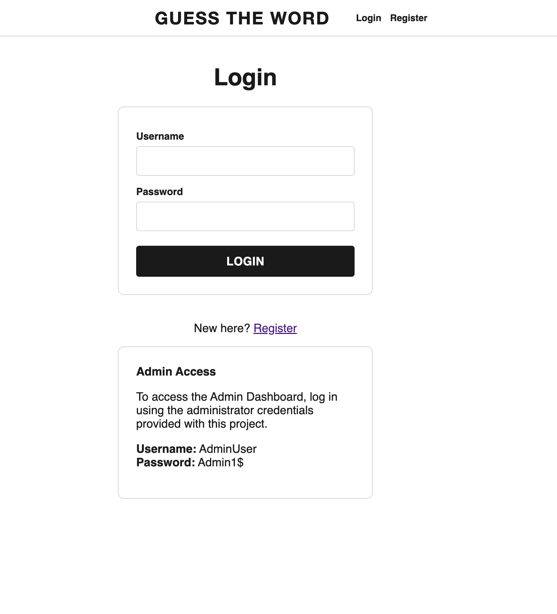
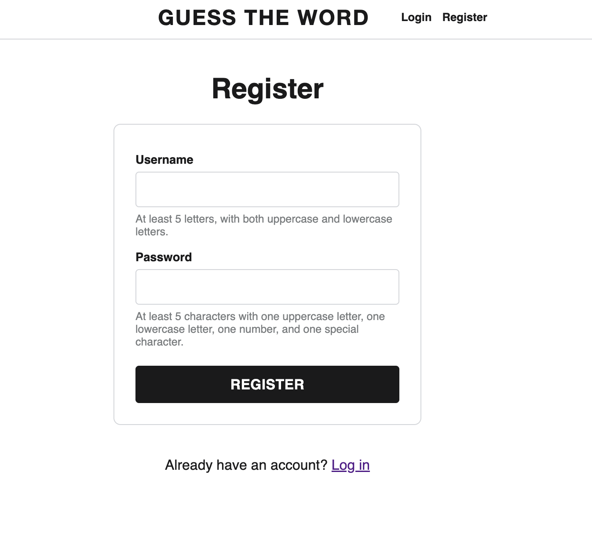
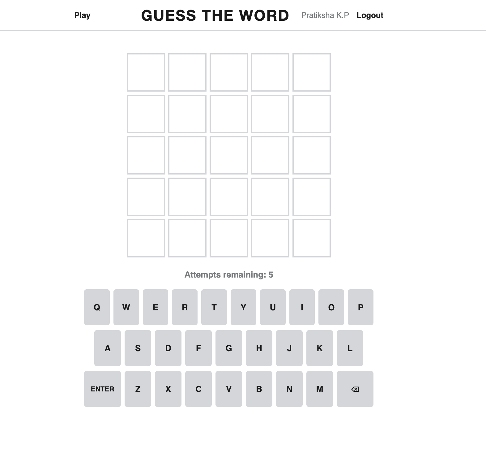
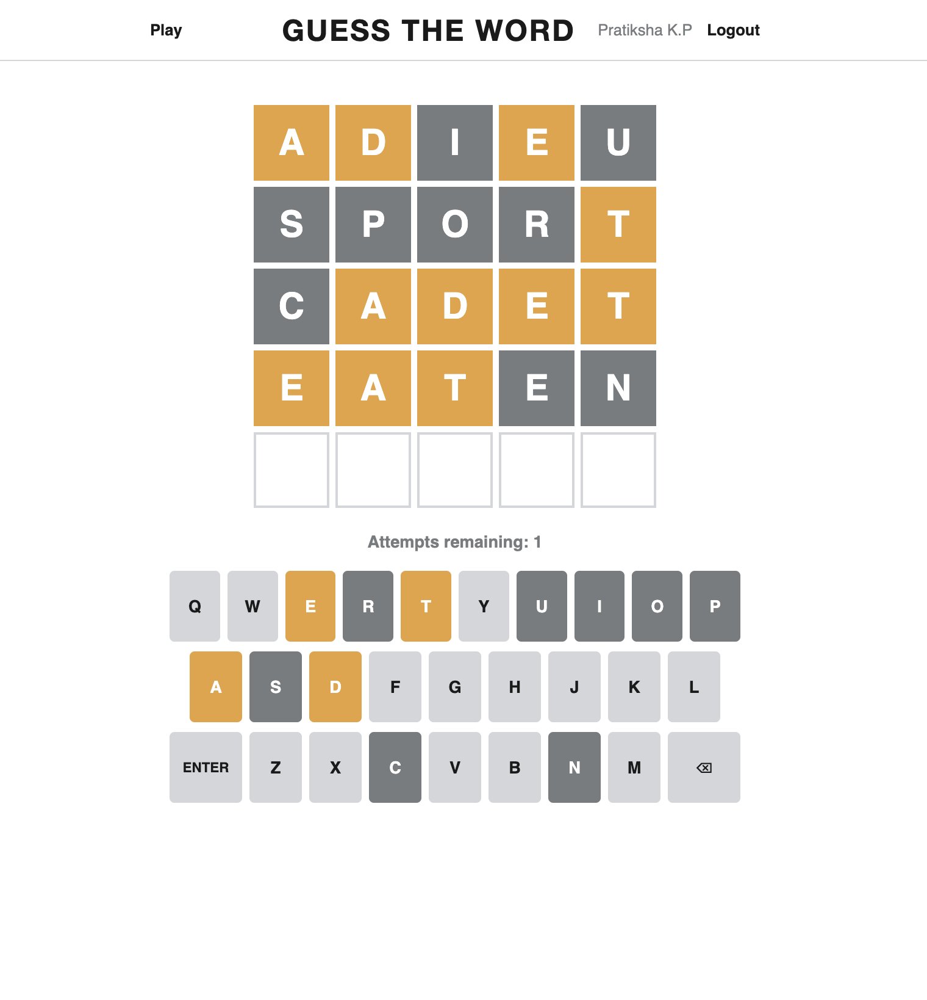
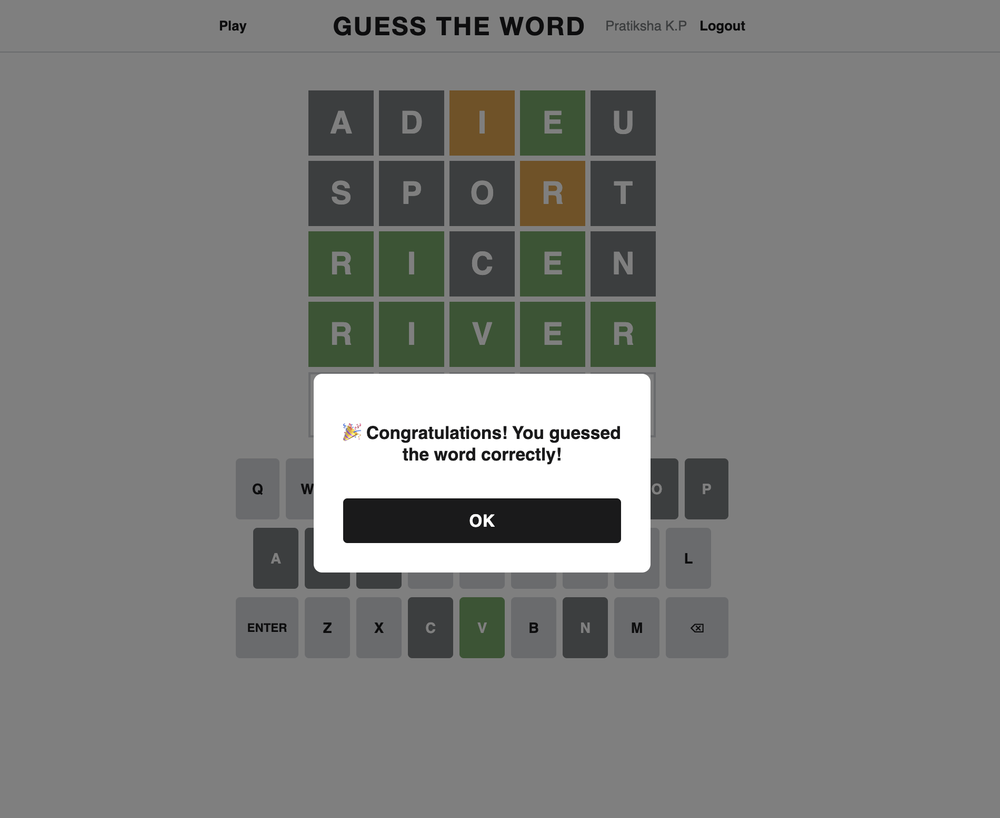
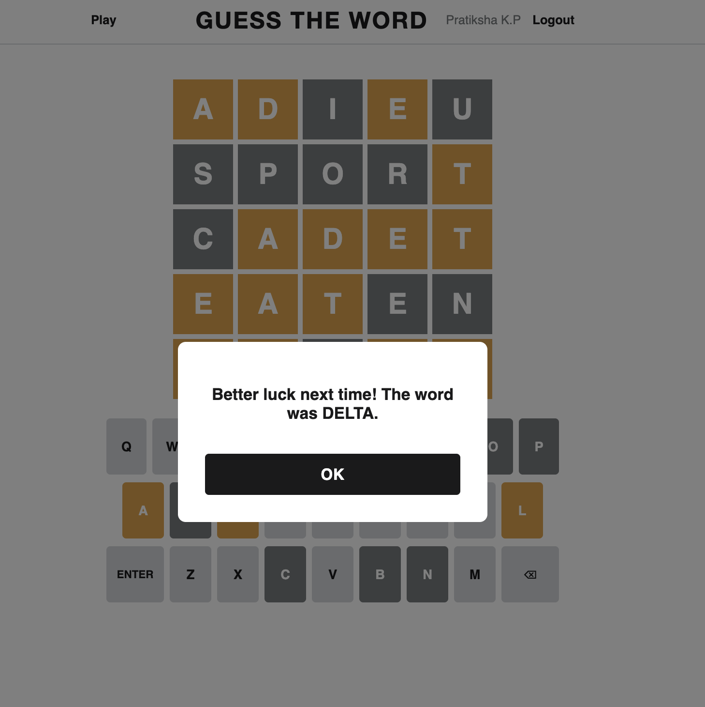
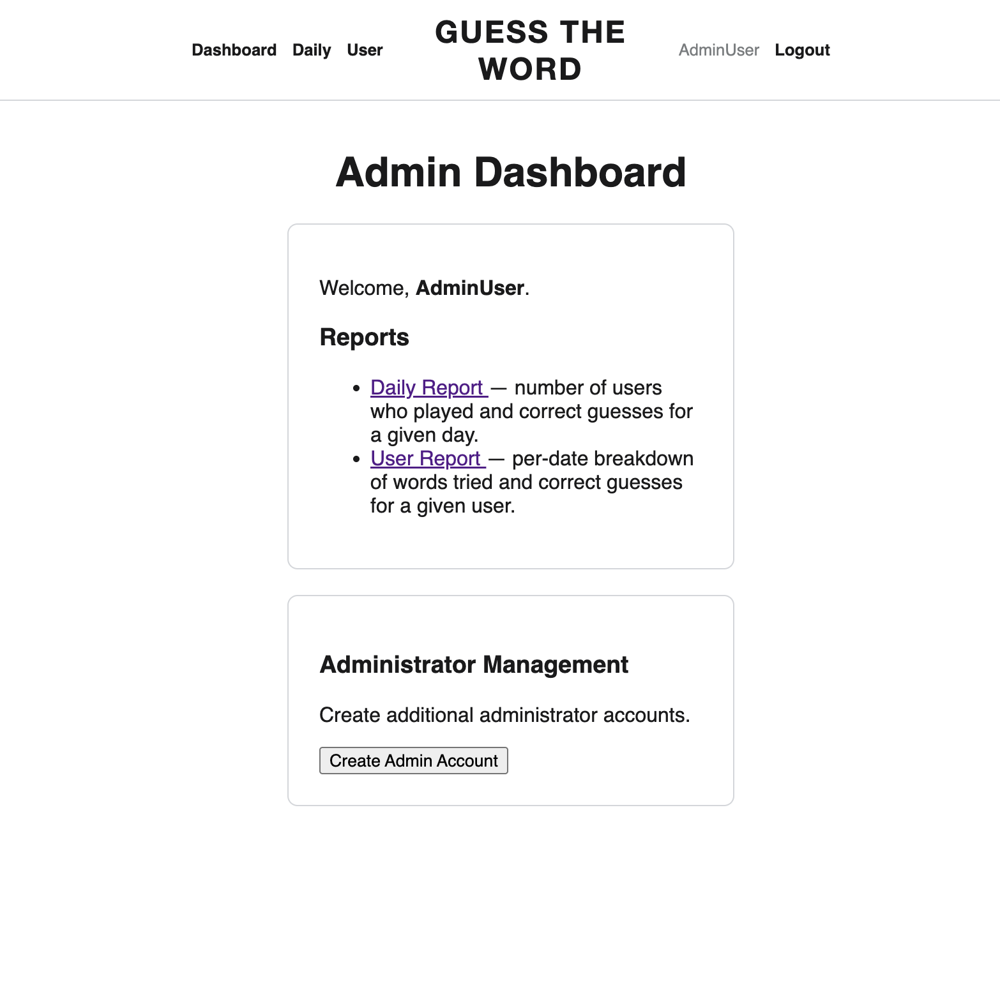
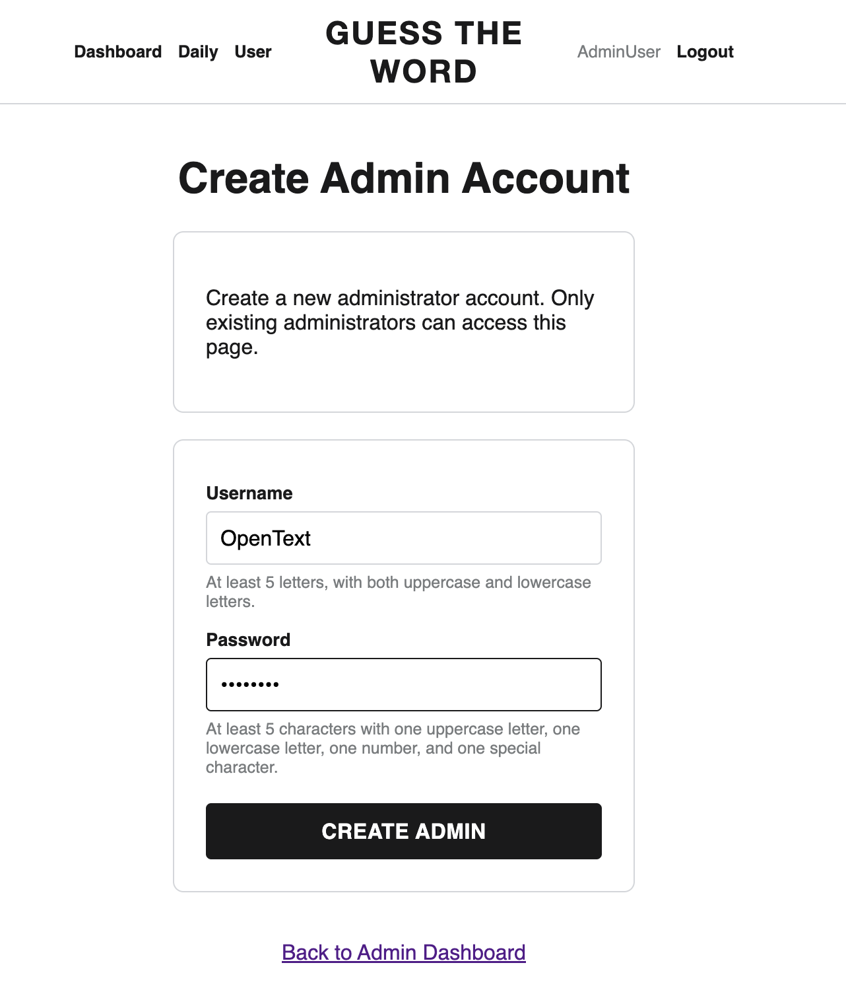
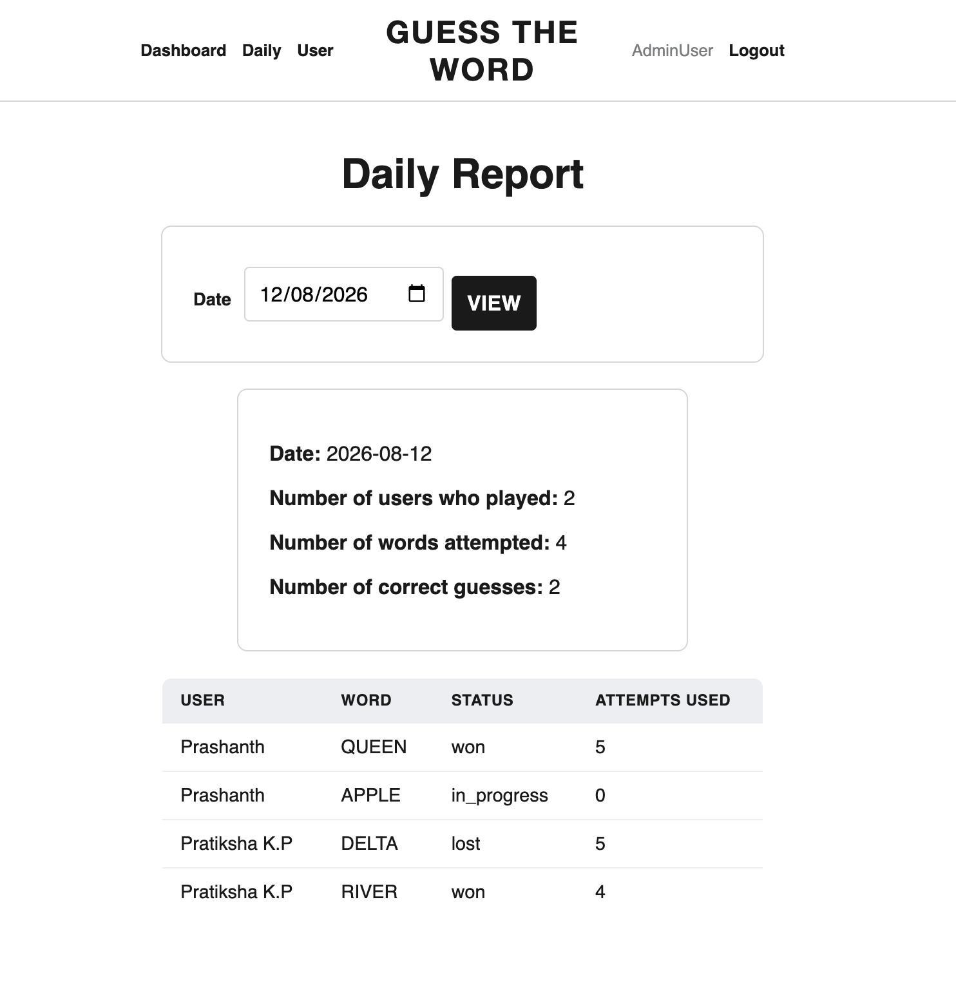
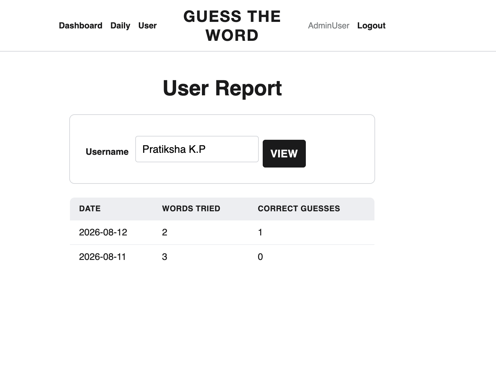

# Guess the Word

A Wordle-style word-guessing game built with Flask + SQLite, with two roles:

- **Player** — registers, logs in, and plays up to 3 words per day (5 guesses per word).
- **Admin** — views a daily report (users played / correct guesses), a per-user report
  (date, words tried, correct guesses), and can create additional admin accounts.

## Screenshots

<!-- Drop screenshots into a /screenshots folder in the repo and update the paths below. -->

### Login


### Register


### Game — empty board


### Game — in progress (colored feedback)


### Win modal


### Loss modal


### Admin dashboard


### Create admin account


### Daily report


### User report


## Stack
- Python 3, Flask, Flask-SQLAlchemy, Flask-Login
- SQLite (file-based, zero setup)
- python-dotenv for environment configuration
- Vanilla JS + CSS for the game board (no frontend framework needed)

## Setup

```bash
python3 -m venv venv
source venv/bin/activate        # venv\Scripts\activate on Windows
python -m pip install -r requirements.txt
```

### Environment variables

The app reads configuration from a `.env` file in the project root (loaded via
`python-dotenv`). Create one before first run:

```bash
SECRET_KEY=replace-with-a-random-string
DATABASE_URL=sqlite:///guess_word.db
ADMIN_USERNAME=AdminUser
ADMIN_PASSWORD=Admin1$
```

- `SECRET_KEY` — Flask session signing key.
- `DATABASE_URL` — SQLAlchemy database URL. Defaults to a local SQLite database if unset.
- `ADMIN_USERNAME` / `ADMIN_PASSWORD` — credentials for the initial administrator account.

> **Note:** `ADMIN_PASSWORD` must be configured before starting the application.

```bash
python app.py
```

The app runs at `http://127.0.0.1:3000`. On first run it auto-creates the SQLite DB,
seeds 20 five-letter words, and creates the bootstrap admin account from your `.env`.

## Validation rules
- **Username:** at least 5 letters, must contain both an uppercase and a lowercase letter.
- **Password:** at least 5 characters, and must contain at least one uppercase letter, one
  lowercase letter, one digit, and one special (non-alphanumeric) character.

## Roles & account creation
- **Public registration** (`/register`) always creates a **player** account — the role is
  fixed server-side regardless of what's submitted in the form, so this endpoint can't be
  used to self-provision an admin.
- **Admin accounts** can only be created by an already-logged-in admin, via
  `/admin/create-admin`. The bootstrap admin from `.env` is the first one; any admin can
  create more from the dashboard.

## Game rules implemented
- One active word per player at a time; max **3 words/day** per player (enforced server-side
  by date, not just client state).
- Max **5 guesses** per word, guesses must be 5-letter alphabetic words (submitted/stored uppercase).
- Feedback per letter uses the standard Wordle two-pass algorithm (handles duplicate letters
  correctly): **green** = right letter & position, **orange** = right letter & wrong position,
  **grey** = letter not in word.
- Win → congratulatory modal; on OK, the game ends. Exhaust 5 guesses without winning →
  "better luck next time" modal revealing the word; on OK, the game ends.
- Previous guesses for the current word stay visible in the grid in the order they were made,
  with a Wordle-style flip animation on reveal and an on-screen keyboard that tracks letter
  status across guesses.
- Every guess is persisted (`guesses` table) with a timestamp, alongside the session's word
  and date (`game_sessions` table), so reports can be reconstructed from the DB alone.

## Admin features
- **Dashboard** (`/admin`) — links to both reports and to admin-account creation.
- **Create Admin** (`/admin/create-admin`) — admin-only form for provisioning additional
  admin accounts, using the same username/password validation as registration.
- **Daily report** (`/admin/report/daily?date=YYYY-MM-DD`) — users who played that day,
  words attempted, and correct guesses.
- **User report** (`/admin/report/user?username=...`) — per-date breakdown of words tried
  and correct guesses for one player.

## Data model
- `users(id, username, password_hash, role)`
- `words(id, word)` — the 20 seed words
- `game_sessions(id, user_id, word_id, play_date, status)` — one row per word attempt
- `guesses(id, session_id, guess_word, feedback, guess_number, guessed_at)` — one row per guess

## Testing

The project includes an automated test suite using **Pytest**.

Run the tests with:

```bash
python -m pytest -v
```

The test suite currently contains 20 tests, all of which pass.

The tests cover:

- Username and password validation
- Player registration and login
- Admin authentication and authorization
- Admin account creation
- Public registration creating Player accounts only
- Word scoring, including duplicate-letter handling
- Invalid guess validation
- Complete win and loss game flows
- Five-guess limit per game
- Three-games-per-day limit
- Prevention of multiple active games
- Player access restrictions for admin routes
- Daily administrative reports
- Per-user administrative reports

Tests use a temporary SQLite database, so running the test suite does not modify the
application's main `guess_word.db` database.

## Future Enhancements

- Password reset/change
- Admin interface for managing game words
- Pagination for large reports
- Admin account de-provisioning